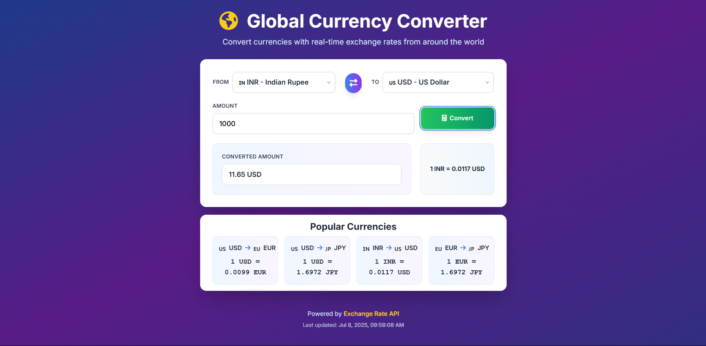

# 💱 Global Currency Converter

A modern, responsive currency converter built with HTML, Tailwind CSS, and JavaScript. It instantly fetches real-time exchange rates for 150+ global currencies, featuring a beautiful gradient glassmorphism UI with smooth animations, interactive currency swapping, popular currency pairs, and a seamless user experience.



[](LICENSE)
[](https://developer.mozilla.org/en-US/docs/Web/HTML)
[](https://developer.mozilla.org/en-US/docs/Web/CSS)
[](https://www.typescriptlang.org/)
[](https://tailwindcss.com/)

[](https://fontawesome.com/)
[](https://git-scm.com/)
[](https://github.com/)
[](https://github.com/)

---

## ✨ Features

- **🌍 150+ Global Currencies**: Support for currencies conversion between all major and many minor world currencies.
- **⚡ Real-Time Exchange Rates**: Live rates powered by **[ExchangeRate-API](https://www.exchangerate-api.com/)**
- **🔄 Quick Currency Swap**: One-click button to instantly swap from/to currencies
- **⭐ Popular Currency Pairs**: Pre-configured popular conversions (USD/EUR, USD/JPY, INR/USD, EUR/JPY)
- **🎨 Modern UI**: Elegant gradient background with glassmorphism effects, smooth animations, and responsive design
- **📱 Fully Responsive**: Works beautifully on desktop, tablet, and mobile devices
- **⚡ Fast & Lightweight**: No frameworks or build tools required—just open and use!
- **🕘 Loading States**: Animated loading spinner and overlay during API calls.
- **⚠️ Error Handling**: Friendly error popups with retry options when something goes wrong.
- **📊 Rate Information**: Detailed exchange rate information with last updated timestamps
- **🎯 User-Friendly**: Intuitive interface with clear labels and smooth interactions
- **♿ Accessibility**: Proper focus states and keyboard navigation support

---

## 🎮 Usage Guide

### Basic Controls

- **Select Currencies**: Choose from 150+ currencies using the dropdown menus with flag emojis
- **Enter Amount**: Type any amount in the input field (defaults to 1)
- **Convert**: Click the "Convert" button or press Enter to get real-time exchange rates
- **Swap Currencies**: Click the exchange button (↔️) to quickly swap from/to currencies
- **View Popular Pairs**: See pre-configured popular currency conversions at the bottom

### Error Handling

- Invalid or empty amounts prompt a friendly error message
- API/network errors are shown as dismissible popups

## 🔧 Tech Stack

### **Technologies Used**
- **HTML5**: Semantic markup with modern structure
- **Tailwind CSS**: Utility-first CSS framework via CDN with custom animations
- **TypeScript**: Type-safe JavaScript for robust code
- **Font Awesome**: Icon library via CDN for beautiful UI icons
- **Exchange Rate API**: Real-time currency exchange rate data
- **Google Fonts**: Inter font family for modern typography
- **Git** – Version control
- **GitHub** – Code hosting and collaboration

### **Key Features**
- **150+ Currencies**: Comprehensive global currency support
- **Real-Time API**: Live exchange rates from Exchange Rate API
- **Custom Animations**: Smooth fade-in, slide-up, and pulse animations
- **Glassmorphism UI**: Modern glass-like design with gradients
- **Ripple Effects**: Interactive button animations
- **Custom Scrollbars**: Styled scrollbars for better UX

## 🛠️ Getting Started

1. **Clone the repository:**
   ```bash
   git clone https://github.com/pvm-harshavardhan/currency-converter.git
   ```
2. **Change to the project directory:**
   ```bash
   cd currency-converter
   ```
3. **Update the API key:**
   - Open `script.ts` and replace the placeholder API key with your own from [ExchangeRate-API](https://www.exchangerate-api.com/).
4. **Open the app:**
   - Open `index.html` in your web browser.
5. **Start converting currencies!** 💱

_No build step or server required!_

## 📁 Project Structure

```
currency-converter/
├── 📄 index.html     # Main HTML file with Tailwind CDN and custom config
├── ⚡ script.ts      # TypeScript logic for currency conversion and API calls
├── ⚡ script.js      # Compiled JavaScript output
├── 🎨 style.css      # Custom CSS styles and animations
├── 🖼️ favLogo.png    # App favicon and logo
└── 📖 README.md      # Project documentation
```

## 🔑 API Configuration

The app uses the **Exchange Rate API** for real-time currency data:

- **API Key**: Configured in `script.ts` (top of file)
- **Base URL**: `https://v6.exchangerate-api.com/v6`
- **Rate Limits**: Check Exchange Rate API documentation for current limits
- **Free Tier**: Available for basic usage

**🔄 Want to use a different quote API provider?**  
You can easily switch to another API by updating the endpoint and API key in `script.ts`.  
Just make sure the new API returns a quote and author in its response, and adjust the code if the response format is different.


## 📱 Browser Compatibility

- ✅ Chrome (recommended)
- ✅ Firefox
- ✅ Safari
- ✅ Edge
- ⚠️ Internet Explorer (limited support)

## 🐛 Troubleshooting

### **Exchange Rates Not Loading?**
1. Check your internet connection
2. Ensure Exchange Rate API key is valid and not rate-limited
3. Check browser console for API errors
4. Verify the API endpoint is accessible

### **Styling Issues?**
1. Make sure Tailwind CSS CDN is accessible
2. Clear browser cache
3. Check if Font Awesome CDN is loading properly

### **Mobile Issues?**
1. The app is fully responsive
2. Touch controls work on mobile devices
3. Currency dropdowns are optimized for mobile interaction

---

## 🖼️ Customization & Screenshots

- Add screenshots or GIFs to highlight features and UI
- Update colors and styles in Tailwind config or HTML classes
- Modify the `currencies` array in `script.ts` to add/remove currencies

---

## 🌐 Deployment

Deploy your Currency Converter easily using **GitHub Pages**, **Netlify**, or **Vercel** for free.

### **GitHub Pages Deployment:**
1. Push your code to GitHub
2. Go to repository Settings > Pages
3. Select source branch (usually `main`)
4. Your app will be available at `https://username.github.io/repository-name`

---

## 🤝 Contributing

Contributions are welcome!  
Feel free to open issues or submit pull requests to improve the app.

### **Potential Improvements:**
- Add historical exchange rate charts
- Implement currency conversion history
- Add offline mode with cached rates
- Include more currency information (symbols, decimal places)
- Add dark/light theme toggle

---

## 📄 License

This project is licensed under the **MIT License** - see the [LICENSE](LICENSE) file for details.

## 📞 Contact

Your Name - [@pvm_harsha](https://x.com/pvm_harsha)  
Project Link: [Currency Converter Web Project](https://github.com/pvm-harshavardhan/currency-converter)

---

**Made with ❤️ by P VM Harsha Vardhan**

**Happy converting! 💱🌍✨** 